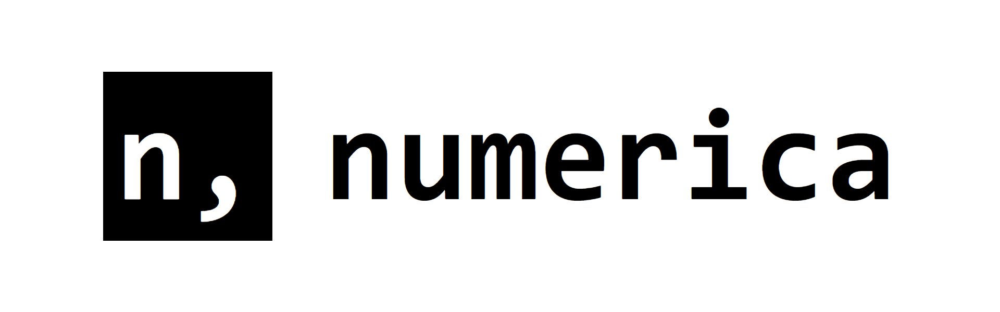

### A utility library for clean and consistent number formatting. Designed to make numeric values more readable.

## Table of contents
1. [Documentation](https://numerica.js.org)
2. [Contributing](https://github.com/alyshukry/numerica?tab=contributing-ov-file#collaborating-guide)
3. [License](https://github.com/alyshukry/numerica?tab=MIT-1-ov-file)
### Installation:
Javascript:
```bash
npm  install  numerica
```
```js
import … from  "numerica"
```